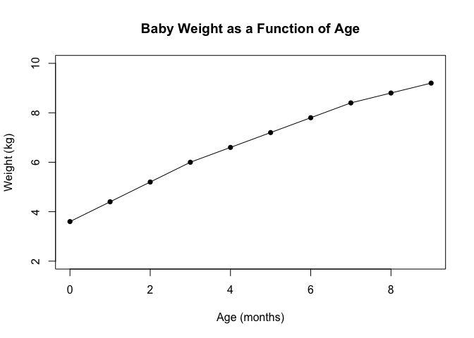
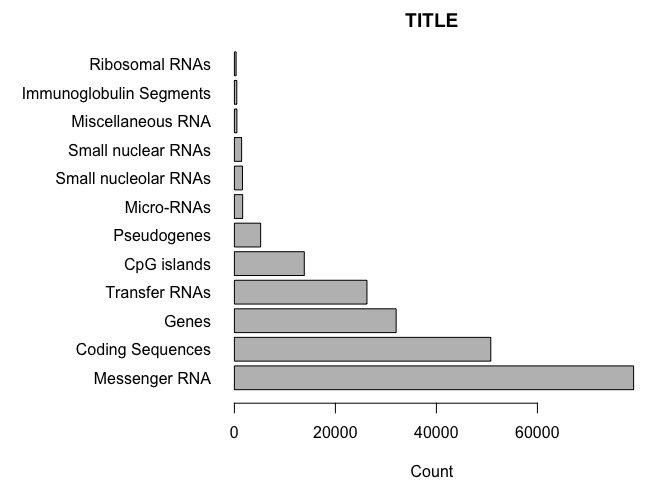
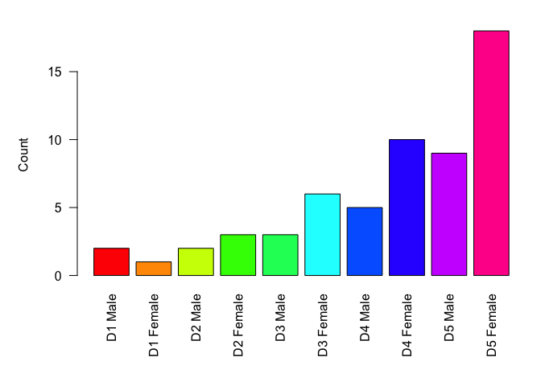

Class 5: R Graphics
================
Saeed Ghassemzadeh
April 16th, 2019

``` r
# Class 5 R graphics

# 2A. Line plot
weight <- read.table("bimm143_05_rstats/weight_chart.txt", header = TRUE)

plot(weight$Age, weight$Weight, pch=16, cex=1, lwd=1, ylim=c(2,10),
     xlab="Age (months)", ylab="Weight (kg)", main = "Baby Weight as a Function of Age", type="o")
```



``` r
# 2B. Barplot
bars <- read.table("bimm143_05_rstats/feature_counts.txt", header = TRUE, sep = "\t") #backslash

par(mar = c(4,12,2,2)) #bottom, left, top, right
barplot(bars$Count, names.arg = bars$Feature, las=1, horiz = TRUE, main = "TITLE", xlab = "Count")
```



``` r
#you can reset your par(mar) here so it doesn't affect future plots -> par(mar=old.par)


# 3A. Providing color vectors
MFcounts <- read.table("bimm143_05_rstats/male_female_counts.txt", header = TRUE, sep = "\t")

# counts <- read.delim("bimm143_05_rstats/male_female_counts.txt") 
# This is for convenience, "delim" already includes the tab in sep

par(mar = c(7,5,2,1))
barplot(MFcounts$Count, names.arg = MFcounts$Sample, las = 2, ylab = "Count",
        col = rainbow(nrow(MFcounts)))
```


