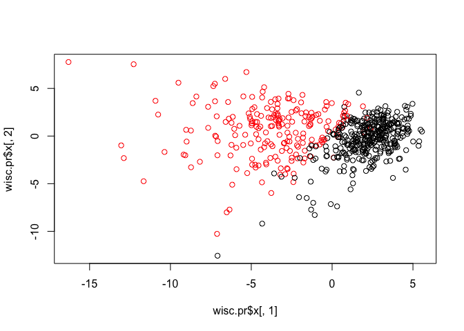
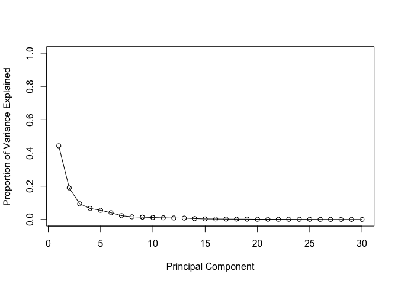
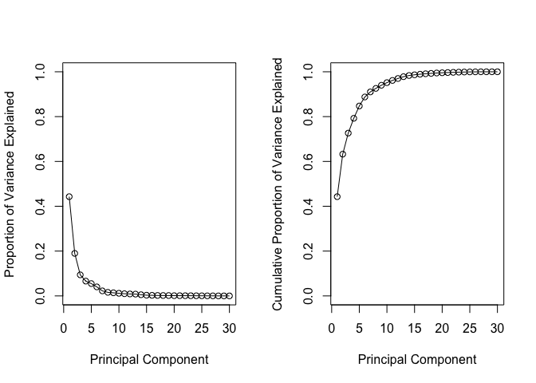

Class 9: <https://bioboot.github.io/bimm143_S19/class-material/lab-9-bimm143.html>
================
Saeed Ghassemzadeh
4/30/2019

Preparing the data
==================

``` r
wisc.df <- read.csv("WisconsinCancer.csv")
head(wisc.df)
```

    ##         id diagnosis radius_mean texture_mean perimeter_mean area_mean
    ## 1   842302         M       17.99        10.38         122.80    1001.0
    ## 2   842517         M       20.57        17.77         132.90    1326.0
    ## 3 84300903         M       19.69        21.25         130.00    1203.0
    ## 4 84348301         M       11.42        20.38          77.58     386.1
    ## 5 84358402         M       20.29        14.34         135.10    1297.0
    ## 6   843786         M       12.45        15.70          82.57     477.1
    ##   smoothness_mean compactness_mean concavity_mean concave.points_mean
    ## 1         0.11840          0.27760         0.3001             0.14710
    ## 2         0.08474          0.07864         0.0869             0.07017
    ## 3         0.10960          0.15990         0.1974             0.12790
    ## 4         0.14250          0.28390         0.2414             0.10520
    ## 5         0.10030          0.13280         0.1980             0.10430
    ## 6         0.12780          0.17000         0.1578             0.08089
    ##   symmetry_mean fractal_dimension_mean radius_se texture_se perimeter_se
    ## 1        0.2419                0.07871    1.0950     0.9053        8.589
    ## 2        0.1812                0.05667    0.5435     0.7339        3.398
    ## 3        0.2069                0.05999    0.7456     0.7869        4.585
    ## 4        0.2597                0.09744    0.4956     1.1560        3.445
    ## 5        0.1809                0.05883    0.7572     0.7813        5.438
    ## 6        0.2087                0.07613    0.3345     0.8902        2.217
    ##   area_se smoothness_se compactness_se concavity_se concave.points_se
    ## 1  153.40      0.006399        0.04904      0.05373           0.01587
    ## 2   74.08      0.005225        0.01308      0.01860           0.01340
    ## 3   94.03      0.006150        0.04006      0.03832           0.02058
    ## 4   27.23      0.009110        0.07458      0.05661           0.01867
    ## 5   94.44      0.011490        0.02461      0.05688           0.01885
    ## 6   27.19      0.007510        0.03345      0.03672           0.01137
    ##   symmetry_se fractal_dimension_se radius_worst texture_worst
    ## 1     0.03003             0.006193        25.38         17.33
    ## 2     0.01389             0.003532        24.99         23.41
    ## 3     0.02250             0.004571        23.57         25.53
    ## 4     0.05963             0.009208        14.91         26.50
    ## 5     0.01756             0.005115        22.54         16.67
    ## 6     0.02165             0.005082        15.47         23.75
    ##   perimeter_worst area_worst smoothness_worst compactness_worst
    ## 1          184.60     2019.0           0.1622            0.6656
    ## 2          158.80     1956.0           0.1238            0.1866
    ## 3          152.50     1709.0           0.1444            0.4245
    ## 4           98.87      567.7           0.2098            0.8663
    ## 5          152.20     1575.0           0.1374            0.2050
    ## 6          103.40      741.6           0.1791            0.5249
    ##   concavity_worst concave.points_worst symmetry_worst
    ## 1          0.7119               0.2654         0.4601
    ## 2          0.2416               0.1860         0.2750
    ## 3          0.4504               0.2430         0.3613
    ## 4          0.6869               0.2575         0.6638
    ## 5          0.4000               0.1625         0.2364
    ## 6          0.5355               0.1741         0.3985
    ##   fractal_dimension_worst  X
    ## 1                 0.11890 NA
    ## 2                 0.08902 NA
    ## 3                 0.08758 NA
    ## 4                 0.17300 NA
    ## 5                 0.07678 NA
    ## 6                 0.12440 NA

Next use as.matrix() to convert the other features (i.e. columns) of the data (in columns 3 through 32) to a matrix. Store this in a variable called wisc.data.

``` r
wisc.data <- as.matrix(wisc.df[,3:32]) # the 33rd column is filled with NA, we don't want that
```

Assign the row names of wisc.data the values currently contained in the id column of wisc.df. While not strictly required, this will help you keep track of the different observations throughout the modeling process.

``` r
rownames(wisc.data) <- wisc.df$id
head(wisc.data)
```

    ##          radius_mean texture_mean perimeter_mean area_mean smoothness_mean
    ## 842302         17.99        10.38         122.80    1001.0         0.11840
    ## 842517         20.57        17.77         132.90    1326.0         0.08474
    ## 84300903       19.69        21.25         130.00    1203.0         0.10960
    ## 84348301       11.42        20.38          77.58     386.1         0.14250
    ## 84358402       20.29        14.34         135.10    1297.0         0.10030
    ## 843786         12.45        15.70          82.57     477.1         0.12780
    ##          compactness_mean concavity_mean concave.points_mean symmetry_mean
    ## 842302            0.27760         0.3001             0.14710        0.2419
    ## 842517            0.07864         0.0869             0.07017        0.1812
    ## 84300903          0.15990         0.1974             0.12790        0.2069
    ## 84348301          0.28390         0.2414             0.10520        0.2597
    ## 84358402          0.13280         0.1980             0.10430        0.1809
    ## 843786            0.17000         0.1578             0.08089        0.2087
    ##          fractal_dimension_mean radius_se texture_se perimeter_se area_se
    ## 842302                  0.07871    1.0950     0.9053        8.589  153.40
    ## 842517                  0.05667    0.5435     0.7339        3.398   74.08
    ## 84300903                0.05999    0.7456     0.7869        4.585   94.03
    ## 84348301                0.09744    0.4956     1.1560        3.445   27.23
    ## 84358402                0.05883    0.7572     0.7813        5.438   94.44
    ## 843786                  0.07613    0.3345     0.8902        2.217   27.19
    ##          smoothness_se compactness_se concavity_se concave.points_se
    ## 842302        0.006399        0.04904      0.05373           0.01587
    ## 842517        0.005225        0.01308      0.01860           0.01340
    ## 84300903      0.006150        0.04006      0.03832           0.02058
    ## 84348301      0.009110        0.07458      0.05661           0.01867
    ## 84358402      0.011490        0.02461      0.05688           0.01885
    ## 843786        0.007510        0.03345      0.03672           0.01137
    ##          symmetry_se fractal_dimension_se radius_worst texture_worst
    ## 842302       0.03003             0.006193        25.38         17.33
    ## 842517       0.01389             0.003532        24.99         23.41
    ## 84300903     0.02250             0.004571        23.57         25.53
    ## 84348301     0.05963             0.009208        14.91         26.50
    ## 84358402     0.01756             0.005115        22.54         16.67
    ## 843786       0.02165             0.005082        15.47         23.75
    ##          perimeter_worst area_worst smoothness_worst compactness_worst
    ## 842302            184.60     2019.0           0.1622            0.6656
    ## 842517            158.80     1956.0           0.1238            0.1866
    ## 84300903          152.50     1709.0           0.1444            0.4245
    ## 84348301           98.87      567.7           0.2098            0.8663
    ## 84358402          152.20     1575.0           0.1374            0.2050
    ## 843786            103.40      741.6           0.1791            0.5249
    ##          concavity_worst concave.points_worst symmetry_worst
    ## 842302            0.7119               0.2654         0.4601
    ## 842517            0.2416               0.1860         0.2750
    ## 84300903          0.4504               0.2430         0.3613
    ## 84348301          0.6869               0.2575         0.6638
    ## 84358402          0.4000               0.1625         0.2364
    ## 843786            0.5355               0.1741         0.3985
    ##          fractal_dimension_worst
    ## 842302                   0.11890
    ## 842517                   0.08902
    ## 84300903                 0.08758
    ## 84348301                 0.17300
    ## 84358402                 0.07678
    ## 843786                   0.12440

Finally, setup a separate new vector called diagnosis to be 1 if a diagnosis is malignant ("M") and 0 otherwise. Note that R coerces TRUE to 1 and FALSE to 0.

``` r
# Create diagnosis vector by completing the missing code
diagnosis <- as.numeric(wisc.df$diagnosis == "M")
```

> Q1. How many patients are in this dataset?

``` r
nrow(wisc.df)
```

    ## [1] 569

> Q2. How many variables/features in the data are suffixed with \_mean?

``` r
length(grep("_mean", colnames(wisc.data)))
```

    ## [1] 10

> Q3. How many of the observations have a malignant diagnosis?

``` r
table(wisc.df$diagnosis)
```

    ## 
    ##   B   M 
    ## 357 212

Performing PCA
==============

Check the mean and standard deviation of the features (i.e. columns) of the wisc.data to determine if the data should be scaled. Use the colMeans() and apply() functions like you’ve done before.

``` r
# Check column means and standard deviations
round(colMeans(wisc.data), 1) # rounding each of the means in the columns to 1 decimal 
```

    ##             radius_mean            texture_mean          perimeter_mean 
    ##                    14.1                    19.3                    92.0 
    ##               area_mean         smoothness_mean        compactness_mean 
    ##                   654.9                     0.1                     0.1 
    ##          concavity_mean     concave.points_mean           symmetry_mean 
    ##                     0.1                     0.0                     0.2 
    ##  fractal_dimension_mean               radius_se              texture_se 
    ##                     0.1                     0.4                     1.2 
    ##            perimeter_se                 area_se           smoothness_se 
    ##                     2.9                    40.3                     0.0 
    ##          compactness_se            concavity_se       concave.points_se 
    ##                     0.0                     0.0                     0.0 
    ##             symmetry_se    fractal_dimension_se            radius_worst 
    ##                     0.0                     0.0                    16.3 
    ##           texture_worst         perimeter_worst              area_worst 
    ##                    25.7                   107.3                   880.6 
    ##        smoothness_worst       compactness_worst         concavity_worst 
    ##                     0.1                     0.3                     0.3 
    ##    concave.points_worst          symmetry_worst fractal_dimension_worst 
    ##                     0.1                     0.3                     0.1

``` r
round(apply(wisc.data,2,sd), 1) # the standard deviation along the columns (2 means columns, 1 would mean rows) rounded to 1 decimal
```

    ##             radius_mean            texture_mean          perimeter_mean 
    ##                     3.5                     4.3                    24.3 
    ##               area_mean         smoothness_mean        compactness_mean 
    ##                   351.9                     0.0                     0.1 
    ##          concavity_mean     concave.points_mean           symmetry_mean 
    ##                     0.1                     0.0                     0.0 
    ##  fractal_dimension_mean               radius_se              texture_se 
    ##                     0.0                     0.3                     0.6 
    ##            perimeter_se                 area_se           smoothness_se 
    ##                     2.0                    45.5                     0.0 
    ##          compactness_se            concavity_se       concave.points_se 
    ##                     0.0                     0.0                     0.0 
    ##             symmetry_se    fractal_dimension_se            radius_worst 
    ##                     0.0                     0.0                     4.8 
    ##           texture_worst         perimeter_worst              area_worst 
    ##                     6.1                    33.6                   569.4 
    ##        smoothness_worst       compactness_worst         concavity_worst 
    ##                     0.0                     0.2                     0.2 
    ##    concave.points_worst          symmetry_worst fractal_dimension_worst 
    ##                     0.1                     0.1                     0.0

Execute PCA with the prcomp() function on the wisc.data, scaling if appropriate, and assign the output model to wisc.pr.

``` r
# Perform PCA on wisc.data by completing the following code
wisc.pr <- prcomp(wisc.data, scale=TRUE)
summary(wisc.pr)
```

    ## Importance of components:
    ##                           PC1    PC2     PC3     PC4     PC5     PC6
    ## Standard deviation     3.6444 2.3857 1.67867 1.40735 1.28403 1.09880
    ## Proportion of Variance 0.4427 0.1897 0.09393 0.06602 0.05496 0.04025
    ## Cumulative Proportion  0.4427 0.6324 0.72636 0.79239 0.84734 0.88759
    ##                            PC7     PC8    PC9    PC10   PC11    PC12
    ## Standard deviation     0.82172 0.69037 0.6457 0.59219 0.5421 0.51104
    ## Proportion of Variance 0.02251 0.01589 0.0139 0.01169 0.0098 0.00871
    ## Cumulative Proportion  0.91010 0.92598 0.9399 0.95157 0.9614 0.97007
    ##                           PC13    PC14    PC15    PC16    PC17    PC18
    ## Standard deviation     0.49128 0.39624 0.30681 0.28260 0.24372 0.22939
    ## Proportion of Variance 0.00805 0.00523 0.00314 0.00266 0.00198 0.00175
    ## Cumulative Proportion  0.97812 0.98335 0.98649 0.98915 0.99113 0.99288
    ##                           PC19    PC20   PC21    PC22    PC23   PC24
    ## Standard deviation     0.22244 0.17652 0.1731 0.16565 0.15602 0.1344
    ## Proportion of Variance 0.00165 0.00104 0.0010 0.00091 0.00081 0.0006
    ## Cumulative Proportion  0.99453 0.99557 0.9966 0.99749 0.99830 0.9989
    ##                           PC25    PC26    PC27    PC28    PC29    PC30
    ## Standard deviation     0.12442 0.09043 0.08307 0.03987 0.02736 0.01153
    ## Proportion of Variance 0.00052 0.00027 0.00023 0.00005 0.00002 0.00000
    ## Cumulative Proportion  0.99942 0.99969 0.99992 0.99997 1.00000 1.00000

``` r
# proportion of variance is 44% for PC1, 18% for PC2; collectively, PC1 and PC2 are 63%; PC1 and PC2 and PC3 is 72% ("cumulative")
```

> Q4. From your results, what proportion of the original variance is captured by the first principal components (PC1)? 44%

> Q5. How many principal components (PCs) are required to describe at least 70% of the original variance in the data? 3 PCs

> Q6. How many principal components (PCs) are required to describe at least 90% of the original variance in the data? 7 PCs

``` r
plot(wisc.pr$x[,1], wisc.pr$x[,2], col=diagnosis+1)
```



Interpreting PCA results
========================

Create a biplot of the wisc.pr using the biplot() function.

``` r
biplot(wisc.pr)
```


``` r
# turns out to be useless
```

Rownames are used as the plotting character for biplots like this one which can make trends rather hard to see. In fact, this plot is very poor. So lets generate a more standard scatter plot of each observation along principal components 1 and 2 (i.e. a plot of PC1 vs PC2 available as the first two columns of wisc.pr$x) and color the points by the diagnosis (available in the diagnosis vector you created earlier).

``` r
# Scatter plot observations by components 1 and 2
plot(wisc.pr$x[,1], wisc.pr$x[,2], col=diagnosis+1 , xlab = "PC1", ylab = "PC2")
```


Because principal component 2 explains more variance in the original data than principal component 3, you can see that the first plot has a cleaner cut separating the two subgroups.

``` r
# Repeat for components 1 and 3
plot(wisc.pr$x[,c(1,3)], col = (diagnosis + 1), xlab = "PC1", ylab = "PC3")
```

 Black points are benign. Red points are malignant.

Variance explained
==================

Calculate the variance of each principal component by squaring the sdev component of wisc.pr (i.e. wisc.pr$sdev^2). Save the result as an object called pr.var.

``` r
# Calculate variance of each component
pr.var <- wisc.pr$sdev^2
head(pr.var)
```

    ## [1] 13.281608  5.691355  2.817949  1.980640  1.648731  1.207357

Calculate the variance explained by each principal component by dividing by the total variance explained of all principal components. Assign this to a variable called pve and create a plot of variance explained for each principal component.

``` r
# Variance explained by each principal component: pve
pve <- pr.var/sum(pr.var)

# Plot variance explained for each principal component
plot(pve, xlab = "Principal Component", ylab = "Proportion of Variance Explained", ylim = c(0, 1), type = "o")
```



``` r
# Alternative scree plot of the same data, note data driven y-axis
barplot(pve, ylab = "Precent of Variance Explained", names.arg=paste0("PC",1:length(pve)), las=2, axes = FALSE)
axis(2, at=pve, labels=round(pve,2)*100 )
```


Using the cumsum() function, create a plot of cumulative proportion of variance explained.

``` r
# Plot cumulative proportion of variance explained
plot(cumsum(pve), xlab = "Principal Component", ylab = "Cumulative Proportion of Variance Explained", ylim = c(0, 1), type = "o")
```


Use the par() function to create a side by side plot (i.e. 1 row 2 column arrangement) of these two graphs.

``` r
par(mfcol=c(1,2))
plot(pve, xlab = "Principal Component", ylab = "Proportion of Variance Explained", ylim = c(0, 1), type = "o")
plot(cumsum(pve), xlab = "Principal Component", ylab = "Cumulative Proportion of Variance Explained", ylim = c(0, 1), type = "o")
```



``` r
## ggplot based graph
#install.packages("factoextra")
library(factoextra)
```

    ## Loading required package: ggplot2

    ## Welcome! Related Books: `Practical Guide To Cluster Analysis in R` at https://goo.gl/13EFCZ

``` r
fviz_eig(wisc.pr, addlabels = TRUE)
```


Communicating PCA results
=========================

> Q9. For the first principal component, what is the component of the loading vector (i.e. wisc.pr$rotation\[,1\]) for the feature concave.points\_mean?

> Q10. What is the minimum number of principal components required to explain 80% of the variance of the data?

Hierarchical clustering of case data
====================================

Scale the wisc.data data and assign the result to data.scaled.

``` r
# Scale the wisc.data data: data.scaled
data.scaled <- scale(wisc.data)
```

Calculate the (Euclidean) distances between all pairs of observations in the new scaled dataset and assign the result to data.dist.

``` r
data.dist <- dist(data.scaled)
```

Create a hierarchical clustering model using complete linkage. Manually specify the method argument to hclust() and assign the results to wisc.hclust.

``` r
wisc.hclust <- hclust(data.dist, method = "complete")
```

Results of hierarchical clustering
==================================

> Q11. Using the plot() and abline() functions, what is the height at which the clustering model has 4 clusters?

``` r
plot(wisc.hclust)
abline(h=19, col="red", lty=2)
```


Selecting number of clusters
============================

Use cutree() to cut the tree so that it has 4 clusters. Assign the output to the variable wisc.hclust.clusters.

``` r
wisc.hclust.clusters <- cutree(wisc.hclust, k = 4)
```

We can use the table() function to compare the cluster membership to the actual diagnoses.

``` r
table(wisc.hclust.clusters, diagnosis)
```

    ##                     diagnosis
    ## wisc.hclust.clusters   0   1
    ##                    1  12 165
    ##                    2   2   5
    ##                    3 343  40
    ##                    4   0   2

``` r
# column 0 --> benign, 12 benign patients clustered into cancer group (misdiagnosed)
# row 3 --> 343 benign patients in benign, but also 40 cancer patients clustered in with them (misdiagnosed)
```

> Q12. Can you find a better cluster vs diagnoses match with by cutting into a different number of clusters between 2 and 10?

Clustering on PCA results
=========================

Using the minimum number of principal components required to describe at least 90% of the variability in the data, create a hierarchical clustering model with the linkage method="ward.D2". We use Ward’s criterion here because it is based on multidimensional variance like principal components analysis. Assign the results to wisc.pr.hclust.

``` r
wisc.pr.hclust <- hclust(dist(wisc.pr$x[,1:7]), method="ward.D2") 
plot(wisc.pr.hclust)
```


``` r
grps <- cutree(wisc.pr.hclust, k=2)
table(grps)
```

    ## grps
    ##   1   2 
    ## 216 353

``` r
table(grps, diagnosis)
```

    ##     diagnosis
    ## grps   0   1
    ##    1  28 188
    ##    2 329  24

``` r
plot(wisc.pr$x[,1:2], col=grps)
```


``` r
plot(wisc.pr$x[,1:2], col=diagnosis+1)
```


Prediction
==========

We will use the predict() function that will take our PCA model from before and new cancer cell data and project that data onto our PCA space.

``` r
url <- "new_samples.csv"
#url <- "https://tinyurl.com/new-samples-CSV"
new <- read.csv(url)
npc <- predict(wisc.pr, newdata=new)
npc
```

    ##            PC1       PC2        PC3        PC4       PC5        PC6
    ## [1,]  2.576616 -3.135913  1.3990492 -0.7631950  2.781648 -0.8150185
    ## [2,] -4.754928 -3.009033 -0.1660946 -0.6052952 -1.140698 -1.2189945
    ##             PC7        PC8       PC9       PC10      PC11      PC12
    ## [1,] -0.3959098 -0.2307350 0.1029569 -0.9272861 0.3411457  0.375921
    ## [2,]  0.8193031 -0.3307423 0.5281896 -0.4855301 0.7173233 -1.185917
    ##           PC13     PC14      PC15       PC16        PC17        PC18
    ## [1,] 0.1610764 1.187882 0.3216974 -0.1743616 -0.07875393 -0.11207028
    ## [2,] 0.5893856 0.303029 0.1299153  0.1448061 -0.40509706  0.06565549
    ##             PC19       PC20       PC21       PC22       PC23       PC24
    ## [1,] -0.08802955 -0.2495216  0.1228233 0.09358453 0.08347651  0.1223396
    ## [2,]  0.25591230 -0.4289500 -0.1224776 0.01732146 0.06316631 -0.2338618
    ##             PC25         PC26         PC27        PC28         PC29
    ## [1,]  0.02124121  0.078884581  0.220199544 -0.02946023 -0.015620933
    ## [2,] -0.20755948 -0.009833238 -0.001134152  0.09638361  0.002795349
    ##              PC30
    ## [1,]  0.005269029
    ## [2,] -0.019015820

``` r
plot(wisc.pr$x[,1:2], col=grps)
points(npc[,1], npc[,2], col="blue", pch=15)
```


> Q17. Which of these new patients should we prioritize for follow up based on your results?
