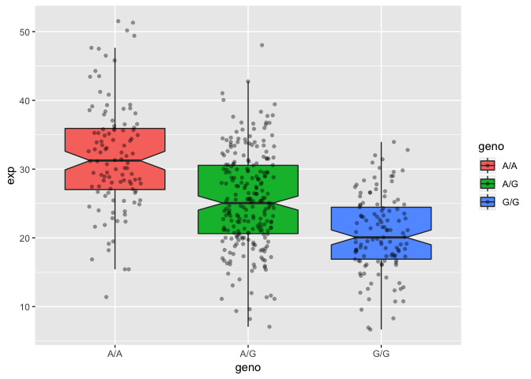

Class 13: Genome Informatics (Pt 1.)
================

Sample genotypes in the MXL 1000 Genome project data
----------------------------------------------------

Here we focus on the Mexican Ancestry in Los Angeles, California (MXL) population

What proportion of the Mexican Ancestry in Los Angeles sample population (MXL) are homozygous for the asthma associated SNP (G|G) rs8067378

``` r
# Read CSV from ENSEMBLE
mxl <- read.csv("373531-SampleGenotypes-Homo_sapiens_Variation_Sample_rs8067378.csv")
head(mxl)
```

    ##   Sample..Male.Female.Unknown. Genotype..forward.strand. Population.s.
    ## 1                  NA19648 (F)                       A|A ALL, AMR, MXL
    ## 2                  NA19649 (M)                       G|G ALL, AMR, MXL
    ## 3                  NA19651 (F)                       A|A ALL, AMR, MXL
    ## 4                  NA19652 (M)                       G|G ALL, AMR, MXL
    ## 5                  NA19654 (F)                       G|G ALL, AMR, MXL
    ## 6                  NA19655 (M)                       A|G ALL, AMR, MXL
    ##   Father Mother
    ## 1      -      -
    ## 2      -      -
    ## 3      -      -
    ## 4      -      -
    ## 5      -      -
    ## 6      -      -

How many of each genotype are there?

``` r
table(mxl$Genotype..forward.strand.)
```

    ## 
    ## A|A A|G G|A G|G 
    ##  22  21  12   9

Proportion or percent of total for each genotype

``` r
(table(mxl$Genotype..forward.strand.) / nrow(mxl) ) * 100
```

    ## 
    ##     A|A     A|G     G|A     G|G 
    ## 34.3750 32.8125 18.7500 14.0625

Quality Scores in FASTQ files
-----------------------------

The forth line of a FASTQ sequence format file encodes the quality score that tells us how good the sequence at a give position is (i.e. how likely it is to be correct based on the instrument)

``` r
library(seqinr)
library(gtools)

#s2c("DDDDCDEDCDDDDBBDDDCC@")
asc( s2c("DDDDCDEDCDDDDBBDDDCC@") ) - 33
```

    ##  D  D  D  D  C  D  E  D  C  D  D  D  D  B  B  D  D  D  C  C  @ 
    ## 35 35 35 35 34 35 36 35 34 35 35 35 35 33 33 35 35 35 34 34 31

``` r
#phred
```

Population Scale analysis
-------------------------

Read RNA-Seq count data with genotype information results table

``` r
expr <- read.table("rs8067378_ENSG00000172057.6.txt")

head(expr)
```

    ##    sample geno      exp
    ## 1 HG00367  A/G 28.96038
    ## 2 NA20768  A/G 20.24449
    ## 3 HG00361  A/A 31.32628
    ## 4 HG00135  A/A 34.11169
    ## 5 NA18870  G/G 18.25141
    ## 6 NA11993  A/A 32.89721

``` r
summary(expr)
```

    ##      sample     geno          exp        
    ##  HG00096:  1   A/A:108   Min.   : 6.675  
    ##  HG00097:  1   A/G:233   1st Qu.:20.004  
    ##  HG00099:  1   G/G:121   Median :25.116  
    ##  HG00100:  1             Mean   :25.640  
    ##  HG00101:  1             3rd Qu.:30.779  
    ##  HG00102:  1             Max.   :51.518  
    ##  (Other):456

``` r
inds <- expr$geno == "G/G"
summary(expr[inds, "exp"])
```

    ##    Min. 1st Qu.  Median    Mean 3rd Qu.    Max. 
    ##   6.675  16.903  20.074  20.594  24.457  33.956

``` r
inds <- expr$geno == "A/G"
summary(expr[inds, "exp"])
```

    ##    Min. 1st Qu.  Median    Mean 3rd Qu.    Max. 
    ##   7.075  20.626  25.065  25.397  30.552  48.034

``` r
inds <- expr$geno == "A/A"
summary(expr[inds, "exp"])
```

    ##    Min. 1st Qu.  Median    Mean 3rd Qu.    Max. 
    ##   11.40   27.02   31.25   31.82   35.92   51.52

``` r
boxplot(exp ~ geno , data=expr)
```


``` r
# Generate a boxplot for expression data of different genotype groups
p <- boxplot(exp~geno, data=expr, xlab="rs8067378 genotype", ylab="ENSG00000172057.4 (RPKM)", notch=T)
```


And maybe ggplot

``` r
library(ggplot2)
```

    ## Warning: package 'ggplot2' was built under R version 3.5.2

``` r
## Histogram of the exp column with ggplot2
ggplot(expr, aes(exp, fill = geno)) + geom_density(alpha = 0.2)
```


``` r
# Boxplot with the data shown
ggplot(expr, aes(geno, exp, fill=geno)) + 
  geom_boxplot(notch=TRUE, outlier.shape = NA) + 
  geom_jitter(shape=16, position=position_jitter(0.2), alpha=0.4)
```


