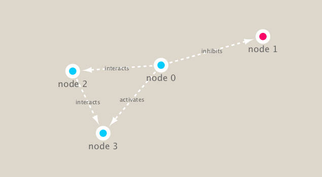

```{r setup, include=FALSE}
knitr::opts_chunk$set(echo = TRUE)
```

## Set up Cytoscape and R connection

We will use the **RCy3** and **igraph** packages in this class.
The first is from bioconductor the second from CRAN

```{r install, eval=FALSE}
# from bioconductor
BiocManager::install("RCy3")

# from CRAN
install.packages("igraph")
```


```{r}
library(RCy3)
library(igraph)
```

Let's check if we can talk to cytoscape...

```{r}
# Test the connection to Cytoscape.
cytoscapePing()
```

```{r}
# Check the version
cytoscapeVersionInfo()
```

```{r}
g <- makeSimpleIgraph()
createNetworkFromIgraph(g,"myGraph")
```

Change the network display style in cytoscape
```{r}
setVisualStyle("Marquee")
```

```{r}
fig <- exportImage(filename="demo_marquee", type="png", height=350)


```

```{r}
g
```


```{r}
plot(g)
```


# Read our metagenomics data

```{r}
prok_vir_cor <- read.delim("virus_prok_cor_abundant.tsv", stringsAsFactors = FALSE)

## Have a peak at the first 6 rows
head(prok_vir_cor)
```

Use the igraph function **graph.data.frame()** to make a network graph

```{r}
g <- graph.data.frame(prok_vir_cor, directed = FALSE)
```


```{r}
plot(g)
```


Turn the node (vertex) labels off in this plot

```{r}
plot(g, vertex.label=NA)
```

Make the vertex much smaller 
```{r}
plot(g, vertex.size=3, vertex.label=NA)
```

Send this network to cytoscape

```{r}
createNetworkFromIgraph(g,"myIgraph")
```

## Network community detection

Community structure detection algorithms try to find dense subgraphs within larger network graphs (i.e. clusters of well connected nodes that are densely connected themselves but sparsely connected to other nodes outside the cluster) . Here we use the classic Girvan & Newman betweenness clustering method. The igraph package has lots of different community detection algorithms (i.e. different methods for finding communities).

```{r}
cb <- cluster_edge_betweenness(g)
```

```{r}
plot(cb, y=g, vertex.label=NA,  vertex.size=3)
```

Node degree

```{r}
# Calculate and plot node degree of our network
d <- degree(g)
hist(d, breaks=30, col="lightblue", main ="Node Degree Distribution")
```

```{r}
plot( degree_distribution(g), type="h")
```

```{r}
plot( degree_distribution(g), type="p", log="xy" )
```


## Read taxonomic classification for network annotation
```{r}
phage_id_affiliation <- read.delim("phage_ids_with_affiliation.tsv")
head(phage_id_affiliation)
```

```{r}
bac_id_affi <- read.delim("prok_tax_from_silva.tsv", stringsAsFactors = FALSE)
head(bac_id_affi)
```

