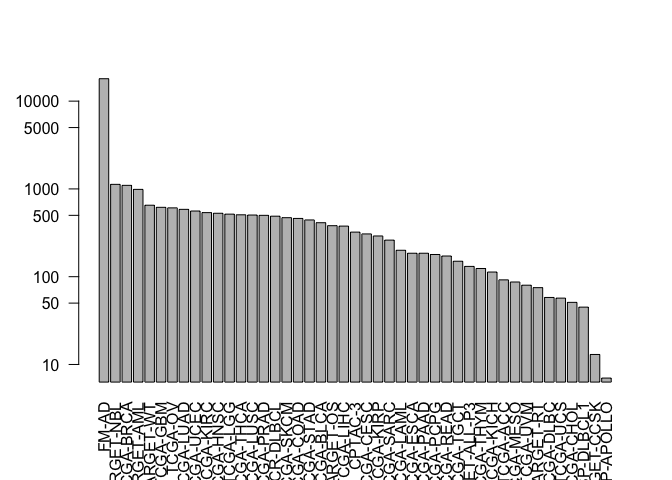
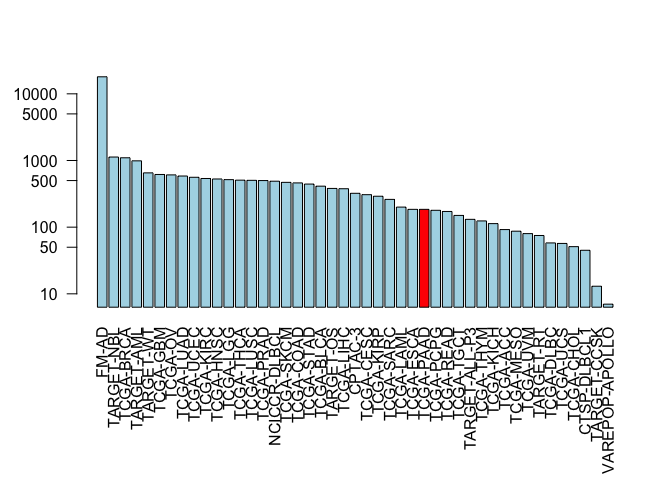
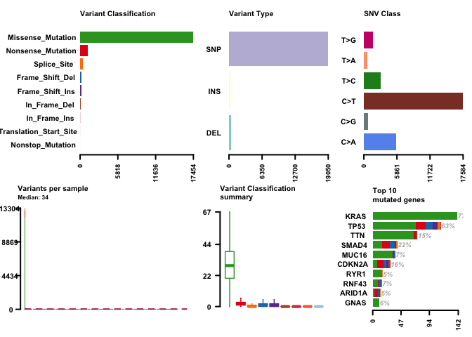
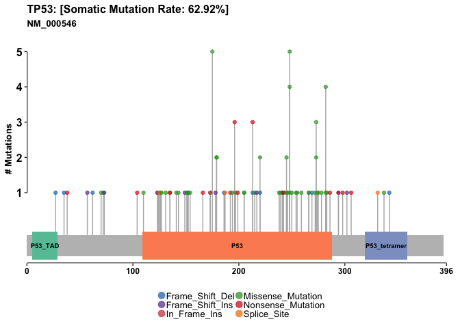

Class 18: Cancer Genomics
================

Exploring the Cancer Genome Atlas
---------------------------------

Install the packages we need:

``` r
BiocManager::install( c("GenomicDataCommons", "TCGAbiolinks", "maftools") )
```

Load the packages

``` r
library(GenomicDataCommons)
```

    ## Loading required package: magrittr

    ## 
    ## Attaching package: 'GenomicDataCommons'

    ## The following object is masked from 'package:stats':
    ## 
    ##     filter

``` r
library(TCGAbiolinks)
```

    ## Warning: package 'TCGAbiolinks' was built under R version 3.5.3

``` r
library(maftools)
```

    ## Warning: package 'maftools' was built under R version 3.5.3

Can we talk witj the NCI-GDC?

``` r
GenomicDataCommons::status()
```

    ## $commit
    ## [1] "e588f035feefee17f562b3a1bc2816c49a2b2b19"
    ## 
    ## $data_release
    ## [1] "Data Release 16.0 - March 26, 2019"
    ## 
    ## $status
    ## [1] "OK"
    ## 
    ## $tag
    ## [1] "1.20.0"
    ## 
    ## $version
    ## [1] 1

``` r
cases_by_project <- cases() %>%
  facet("project.project_id") %>%
  aggregations()
head(cases_by_project)
```

    ## $project.project_id
    ##               key doc_count
    ## 1           FM-AD     18004
    ## 2      TARGET-NBL      1127
    ## 3       TCGA-BRCA      1098
    ## 4      TARGET-AML       988
    ## 5       TARGET-WT       652
    ## 6        TCGA-GBM       617
    ## 7         TCGA-OV       608
    ## 8       TCGA-LUAD       585
    ## 9       TCGA-UCEC       560
    ## 10      TCGA-KIRC       537
    ## 11      TCGA-HNSC       528
    ## 12       TCGA-LGG       516
    ## 13      TCGA-THCA       507
    ## 14      TCGA-LUSC       504
    ## 15      TCGA-PRAD       500
    ## 16   NCICCR-DLBCL       489
    ## 17      TCGA-SKCM       470
    ## 18      TCGA-COAD       461
    ## 19      TCGA-STAD       443
    ## 20      TCGA-BLCA       412
    ## 21      TARGET-OS       381
    ## 22      TCGA-LIHC       377
    ## 23        CPTAC-3       322
    ## 24      TCGA-CESC       307
    ## 25      TCGA-KIRP       291
    ## 26      TCGA-SARC       261
    ## 27      TCGA-LAML       200
    ## 28      TCGA-ESCA       185
    ## 29      TCGA-PAAD       185
    ## 30      TCGA-PCPG       179
    ## 31      TCGA-READ       172
    ## 32      TCGA-TGCT       150
    ## 33  TARGET-ALL-P3       131
    ## 34      TCGA-THYM       124
    ## 35      TCGA-KICH       113
    ## 36       TCGA-ACC        92
    ## 37      TCGA-MESO        87
    ## 38       TCGA-UVM        80
    ## 39      TARGET-RT        75
    ## 40      TCGA-DLBC        58
    ## 41       TCGA-UCS        57
    ## 42      TCGA-CHOL        51
    ## 43    CTSP-DLBCL1        45
    ## 44    TARGET-CCSK        13
    ## 45 VAREPOP-APOLLO         7

Make a summary plot for this data

``` r
x <- cases_by_project$project.project_id
barplot(x$doc_count, names.arg=x$key, log="y", las=2)
```



``` r
# Make a custom color vector for our plot
colvec <- rep("lightblue", nrow(x))
colvec[which(x$key == "TCGA-PAAD")] <- "red"

# Plot with 'log' for y axis and rotate labels with 'las'
par(mar=c(9,4,4,2))  
barplot(x$doc_count, names.arg=x$key, log="y", col=colvec, las=2)
```



Variant analysis with R
-----------------------

``` r
maf.file <- GDCquery_Maf(tumor="PAAD", pipelines = "mutect")
```

    ## ============================================================================

    ##  For more information about MAF data please read the following GDC manual and web pages:

    ##  GDC manual: https://gdc-docs.nci.nih.gov/Data/PDF/Data_UG.pdf

    ##  https://gdc-docs.nci.nih.gov/Data/Bioinformatics_Pipelines/DNA_Seq_Variant_Calling_Pipeline/

    ##  https://gdc.cancer.gov/about-gdc/variant-calling-gdc

    ## ============================================================================

    ## --------------------------------------

    ## o GDCquery: Searching in GDC database

    ## --------------------------------------

    ## Genome of reference: hg38

    ## --------------------------------------------

    ## oo Accessing GDC. This might take a while...

    ## --------------------------------------------

    ## ooo Project: TCGA-PAAD

    ## --------------------

    ## oo Filtering results

    ## --------------------

    ## ooo By access

    ## ooo By data.type

    ## ooo By workflow.type

    ## ----------------

    ## oo Checking data

    ## ----------------

    ## ooo Check if there are duplicated cases

    ## ooo Check if there results for the query

    ## -------------------

    ## o Preparing output

    ## -------------------

    ## Downloading data for project TCGA-PAAD

    ## Of the 1 files for download 1 already exist.

    ## All samples have been already downloaded

    ## 
    |==========                                                 |  17%    7 MB
    |==========                                                 |  17%    7 MB
    |==========                                                 |  17%    7 MB
    |==========                                                 |  18%    7 MB
    |===========                                                |  18%    7 MB
    |===========                                                |  18%    7 MB
    |===========                                                |  19%    8 MB
    |===========                                                |  19%    8 MB
    |===========                                                |  19%    8 MB
    |===========                                                |  19%    8 MB
    |============                                               |  20%    8 MB
    |============                                               |  20%    8 MB
    |============                                               |  20%    8 MB
    |============                                               |  20%    8 MB
    |============                                               |  21%    8 MB
    |============                                               |  21%    9 MB
    |=============                                              |  21%    9 MB
    |=============                                              |  21%    9 MB
    |=============                                              |  22%    9 MB
    |=============                                              |  22%    9 MB
    |=============                                              |  22%    9 MB
    |=============                                              |  23%    9 MB
    |=============                                              |  23%    9 MB
    |==============                                             |  23%    9 MB
    |==============                                             |  23%   10 MB
    |==============                                             |  24%   10 MB
    |==============                                             |  24%   10 MB
    |==============                                             |  24%   10 MB
    |==============                                             |  24%   10 MB
    |===============                                            |  25%   10 MB
    |===============                                            |  25%   10 MB
    |===============                                            |  25%   10 MB
    |===============                                            |  25%   10 MB
    |===============                                            |  26%   11 MB
    |===============                                            |  26%   11 MB
    |===============                                            |  26%   11 MB
    |================                                           |  26%   11 MB
    |================                                           |  27%   11 MB
    |================                                           |  27%   11 MB
    |================                                           |  27%   11 MB
    |================                                           |  28%   11 MB
    |=================                                          |  28%   11 MB
    |=================                                          |  28%   12 MB
    |=================                                          |  28%   12 MB
    |=================                                          |  29%   12 MB
    |=================                                          |  29%   12 MB
    |=================                                          |  29%   12 MB
    |==================                                         |  30%   12 MB
    |==================                                         |  30%   12 MB
    |==================                                         |  30%   12 MB
    |==================                                         |  30%   13 MB
    |==================                                         |  31%   13 MB
    |==================                                         |  31%   13 MB
    |===================                                        |  31%   13 MB
    |===================                                        |  32%   13 MB
    |===================                                        |  32%   13 MB
    |===================                                        |  32%   13 MB
    |===================                                        |  33%   13 MB
    |===================                                        |  33%   14 MB
    |====================                                       |  33%   14 MB
    |====================                                       |  33%   14 MB
    |====================                                       |  34%   14 MB
    |====================                                       |  34%   14 MB
    |====================                                       |  34%   14 MB
    |====================                                       |  34%   14 MB
    |=====================                                      |  35%   14 MB
    |=====================                                      |  35%   14 MB
    |=====================                                      |  35%   15 MB
    |=====================                                      |  36%   15 MB
    |=====================                                      |  36%   15 MB
    |=====================                                      |  36%   15 MB
    |======================                                     |  36%   15 MB
    |======================                                     |  37%   15 MB
    |======================                                     |  37%   15 MB
    |======================                                     |  37%   15 MB
    |======================                                     |  37%   15 MB
    |======================                                     |  38%   16 MB
    |=======================                                    |  38%   16 MB
    |=======================                                    |  38%   16 MB
    |=======================                                    |  38%   16 MB
    |=======================                                    |  39%   16 MB
    |=======================                                    |  39%   16 MB
    |=======================                                    |  39%   16 MB
    |=======================                                    |  39%   16 MB
    |========================                                   |  40%   16 MB
    |========================                                   |  40%   17 MB
    |========================                                   |  40%   17 MB
    |========================                                   |  41%   17 MB
    |========================                                   |  41%   17 MB
    |=========================                                  |  41%   17 MB
    |=========================                                  |  41%   17 MB
    |=========================                                  |  42%   17 MB
    |=========================                                  |  42%   17 MB
    |=========================                                  |  42%   18 MB
    |=========================                                  |  43%   18 MB
    |==========================                                 |  43%   18 MB
    |==========================                                 |  43%   18 MB
    |==========================                                 |  43%   18 MB
    |==========================                                 |  44%   18 MB
    |==========================                                 |  44%   18 MB
    |==========================                                 |  44%   18 MB
    |==========================                                 |  44%   18 MB
    |===========================                                |  45%   19 MB
    |===========================                                |  45%   19 MB
    |===========================                                |  45%   19 MB
    |===========================                                |  46%   19 MB
    |===========================                                |  46%   19 MB
    |===========================                                |  46%   19 MB
    |============================                               |  46%   19 MB
    |============================                               |  47%   19 MB
    |============================                               |  47%   19 MB
    |============================                               |  47%   20 MB
    |============================                               |  47%   20 MB
    |============================                               |  48%   20 MB
    |=============================                              |  48%   20 MB
    |=============================                              |  48%   20 MB
    |=============================                              |  49%   20 MB
    |=============================                              |  49%   20 MB
    |=============================                              |  49%   20 MB
    |=============================                              |  49%   20 MB
    |==============================                             |  50%   21 MB
    |==============================                             |  50%   21 MB
    |==============================                             |  50%   21 MB
    |==============================                             |  50%   21 MB
    |==============================                             |  51%   21 MB
    |==============================                             |  51%   21 MB
    |===============================                            |  51%   21 MB
    |===============================                            |  51%   21 MB
    |===============================                            |  52%   21 MB
    |===============================                            |  52%   22 MB
    |===============================                            |  52%   22 MB
    |===============================                            |  53%   22 MB
    |===============================                            |  53%   22 MB
    |================================                           |  53%   22 MB
    |================================                           |  53%   22 MB
    |================================                           |  54%   22 MB
    |================================                           |  54%   22 MB
    |================================                           |  54%   22 MB
    |================================                           |  54%   23 MB
    |=================================                          |  55%   23 MB
    |=================================                          |  55%   23 MB
    |=================================                          |  55%   23 MB
    |=================================                          |  55%   23 MB
    |=================================                          |  56%   23 MB
    |=================================                          |  56%   23 MB
    |==================================                         |  56%   23 MB
    |==================================                         |  56%   23 MB
    |==================================                         |  57%   24 MB
    |==================================                         |  57%   24 MB
    |==================================                         |  57%   24 MB
    |==================================                         |  58%   24 MB
    |===================================                        |  58%   24 MB
    |===================================                        |  58%   24 MB
    |===================================                        |  59%   24 MB
    |===================================                        |  59%   24 MB
    |===================================                        |  59%   25 MB
    |===================================                        |  59%   25 MB
    |====================================                       |  60%   25 MB
    |====================================                       |  60%   25 MB
    |====================================                       |  60%   25 MB
    |====================================                       |  61%   25 MB
    |====================================                       |  61%   25 MB
    |====================================                       |  61%   25 MB
    |=====================================                      |  61%   26 MB
    |=====================================                      |  62%   26 MB
    |=====================================                      |  62%   26 MB
    |=====================================                      |  62%   26 MB
    |=====================================                      |  63%   26 MB
    |======================================                     |  63%   26 MB
    |======================================                     |  63%   26 MB
    |======================================                     |  63%   26 MB
    |======================================                     |  64%   26 MB
    |======================================                     |  64%   27 MB
    |======================================                     |  64%   27 MB
    |======================================                     |  64%   27 MB
    |=======================================                    |  65%   27 MB
    |=======================================                    |  65%   27 MB
    |=======================================                    |  65%   27 MB
    |=======================================                    |  66%   27 MB
    |=======================================                    |  66%   27 MB
    |=======================================                    |  66%   27 MB
    |========================================                   |  66%   28 MB
    |========================================                   |  67%   28 MB
    |========================================                   |  67%   28 MB
    |========================================                   |  67%   28 MB
    |========================================                   |  67%   28 MB
    |========================================                   |  68%   28 MB
    |=========================================                  |  68%   28 MB
    |=========================================                  |  68%   28 MB
    |=========================================                  |  69%   29 MB
    |=========================================                  |  69%   29 MB
    |=========================================                  |  69%   29 MB
    |==========================================                 |  70%   29 MB
    |==========================================                 |  70%   29 MB
    |==========================================                 |  70%   29 MB
    |==========================================                 |  70%   29 MB
    |==========================================                 |  71%   29 MB
    |==========================================                 |  71%   30 MB
    |===========================================                |  71%   30 MB
    |===========================================                |  72%   30 MB
    |===========================================                |  72%   30 MB
    |===========================================                |  72%   30 MB
    |===========================================                |  73%   30 MB
    |============================================               |  73%   30 MB
    |============================================               |  73%   31 MB
    |============================================               |  74%   31 MB
    |============================================               |  74%   31 MB
    |============================================               |  74%   31 MB
    |============================================               |  74%   31 MB
    |=============================================              |  75%   31 MB
    |=============================================              |  75%   31 MB
    |=============================================              |  75%   31 MB
    |=============================================              |  76%   32 MB
    |=============================================              |  76%   32 MB
    |==============================================             |  76%   32 MB
    |==============================================             |  77%   32 MB
    |==============================================             |  77%   32 MB
    |==============================================             |  77%   32 MB
    |==============================================             |  77%   32 MB
    |==============================================             |  78%   32 MB
    |===============================================            |  78%   33 MB
    |===============================================            |  78%   33 MB
    |===============================================            |  79%   33 MB
    |===============================================            |  79%   33 MB
    |===============================================            |  79%   33 MB
    |================================================           |  80%   33 MB
    |================================================           |  80%   33 MB
    |================================================           |  80%   33 MB
    |================================================           |  80%   33 MB
    |================================================           |  81%   34 MB
    |================================================           |  81%   34 MB
    |=================================================          |  81%   34 MB
    |=================================================          |  82%   34 MB
    |=================================================          |  82%   34 MB
    |=================================================          |  82%   34 MB
    |=================================================          |  82%   34 MB
    |=================================================          |  83%   34 MB
    |==================================================         |  83%   35 MB
    |==================================================         |  83%   35 MB
    |==================================================         |  84%   35 MB
    |==================================================         |  84%   35 MB
    |==================================================         |  84%   35 MB
    |==================================================         |  84%   35 MB
    |===================================================        |  85%   35 MB
    |===================================================        |  85%   35 MB
    |===================================================        |  85%   36 MB
    |===================================================        |  85%   36 MB
    |===================================================        |  86%   36 MB
    |===================================================        |  86%   36 MB
    |====================================================       |  86%   36 MB
    |====================================================       |  87%   36 MB
    |====================================================       |  87%   36 MB
    |====================================================       |  87%   36 MB
    |====================================================       |  87%   36 MB
    |====================================================       |  88%   37 MB
    |====================================================       |  88%   37 MB
    |=====================================================      |  88%   37 MB
    |=====================================================      |  88%   37 MB
    |=====================================================      |  89%   37 MB
    |=====================================================      |  89%   37 MB
    |=====================================================      |  89%   37 MB
    |=====================================================      |  89%   37 MB
    |======================================================     |  90%   37 MB
    |======================================================     |  90%   38 MB
    |======================================================     |  90%   38 MB
    |======================================================     |  91%   38 MB
    |======================================================     |  91%   38 MB
    |======================================================     |  91%   38 MB
    |=======================================================    |  91%   38 MB
    |=======================================================    |  92%   38 MB
    |=======================================================    |  92%   38 MB
    |=======================================================    |  92%   38 MB
    |=======================================================    |  92%   39 MB
    |=======================================================    |  93%   39 MB
    |========================================================   |  93%   39 MB
    |========================================================   |  93%   39 MB
    |========================================================   |  94%   39 MB
    |========================================================   |  94%   39 MB
    |========================================================   |  94%   39 MB
    |========================================================   |  94%   39 MB
    |=========================================================  |  95%   40 MB
    |=========================================================  |  95%   40 MB
    |=========================================================  |  95%   40 MB
    |=========================================================  |  96%   40 MB
    |=========================================================  |  96%   40 MB
    |=========================================================  |  96%   40 MB
    |========================================================== |  96%   40 MB
    |========================================================== |  97%   40 MB
    |========================================================== |  97%   40 MB
    |========================================================== |  97%   41 MB
    |========================================================== |  97%   41 MB
    |========================================================== |  98%   41 MB
    |===========================================================|  98%   41 MB
    |===========================================================|  98%   41 MB
    |===========================================================|  99%   41 MB
    |===========================================================|  99%   41 MB
    |===========================================================|  99%   41 MB
    |===========================================================|  99%   41 MB
    |============================================================| 100%   42 MB

Read the MAF file

``` r
vars = read.maf(maf = maf.file, verbose = FALSE)
```

``` r
plotmafSummary(vars)
```



``` r
lollipopPlot(vars, gene='TP53')
```

    ## Assuming protein change information are stored under column HGVSp_Short. Use argument AACol to override if necessary.

    ## 8 transcripts available. Use arguments refSeqID or proteinID to manually specify tx name.

    ##    HGNC    refseq.ID   protein.ID aa.length
    ## 1: TP53    NM_000546    NP_000537       393
    ## 2: TP53 NM_001126112 NP_001119584       393
    ## 3: TP53 NM_001126118 NP_001119590       354
    ## 4: TP53 NM_001126115 NP_001119587       261
    ## 5: TP53 NM_001126113 NP_001119585       346
    ## 6: TP53 NM_001126117 NP_001119589       214
    ## 7: TP53 NM_001126114 NP_001119586       341
    ## 8: TP53 NM_001126116 NP_001119588       209

    ## Using longer transcript NM_000546 for now.



Part II.
========

Identify tumor specific 9-mer peptides
--------------------------------------

``` r
library(bio3d)
```

``` r
seqs <- read.fasta("lecture18_sequences.fa")
seqs
```

    ##              1        .         .         .         .         .         60 
    ## P53_wt       MEEPQSDPSVEPPLSQETFSDLWKLLPENNVLSPLPSQAMDDLMLSPDDIEQWFTEDPGP
    ## P53_mutant   MEEPQSDPSVEPPLSQETFSDLWKLLPENNVLSPLPSQAMLDLMLSPDDIEQWFTEDPGP
    ##              **************************************** ******************* 
    ##              1        .         .         .         .         .         60 
    ## 
    ##             61        .         .         .         .         .         120 
    ## P53_wt       DEAPRMPEAAPPVAPAPAAPTPAAPAPAPSWPLSSSVPSQKTYQGSYGFRLGFLHSGTAK
    ## P53_mutant   DEAPWMPEAAPPVAPAPAAPTPAAPAPAPSWPLSSSVPSQKTYQGSYGFRLGFLHSGTAK
    ##              **** ******************************************************* 
    ##             61        .         .         .         .         .         120 
    ## 
    ##            121        .         .         .         .         .         180 
    ## P53_wt       SVTCTYSPALNKMFCQLAKTCPVQLWVDSTPPPGTRVRAMAIYKQSQHMTEVVRRCPHHE
    ## P53_mutant   SVTCTYSPALNKMFCQLAKTCPVQLWVDSTPPPGTRVRAMAIYKQSQHMTEVVRRCPHHE
    ##              ************************************************************ 
    ##            121        .         .         .         .         .         180 
    ## 
    ##            181        .         .         .         .         .         240 
    ## P53_wt       RCSDSDGLAPPQHLIRVEGNLRVEYLDDRNTFRHSVVVPYEPPEVGSDCTTIHYNYMCNS
    ## P53_mutant   RCSDSDGLAPPQHLIRVEGNLRVEYLDDRNTFVHSVVVPYEPPEVGSDCTTIHYNYMCNS
    ##              ******************************** *************************** 
    ##            181        .         .         .         .         .         240 
    ## 
    ##            241        .         .         .         .         .         300 
    ## P53_wt       SCMGGMNRRPILTIITLEDSSGNLLGRNSFEVRVCACPGRDRRTEEENLRKKGEPHHELP
    ## P53_mutant   SCMGGMNRRPILTIITLEV-----------------------------------------
    ##              ******************                                           
    ##            241        .         .         .         .         .         300 
    ## 
    ##            301        .         .         .         .         .         360 
    ## P53_wt       PGSTKRALPNNTSSSPQPKKKPLDGEYFTLQIRGRERFEMFRELNEALELKDAQAGKEPG
    ## P53_mutant   ------------------------------------------------------------
    ##                                                                           
    ##            301        .         .         .         .         .         360 
    ## 
    ##            361        .         .         .  393 
    ## P53_wt       GSRAHSSHLKSKKGQSTSRHKKLMFKTEGPDSD
    ## P53_mutant   ---------------------------------
    ##                                                
    ##            361        .         .         .  393 
    ## 
    ## Call:
    ##   read.fasta(file = "lecture18_sequences.fa")
    ## 
    ## Class:
    ##   fasta
    ## 
    ## Alignment dimensions:
    ##   2 sequence rows; 393 position columns (259 non-gap, 134 gap) 
    ## 
    ## + attr: id, ali, call

Now find where the sequences differ

``` r
ide <- conserv(seqs, method = "identity")
ide
```

    ##   [1] 1.0 1.0 1.0 1.0 1.0 1.0 1.0 1.0 1.0 1.0 1.0 1.0 1.0 1.0 1.0 1.0 1.0
    ##  [18] 1.0 1.0 1.0 1.0 1.0 1.0 1.0 1.0 1.0 1.0 1.0 1.0 1.0 1.0 1.0 1.0 1.0
    ##  [35] 1.0 1.0 1.0 1.0 1.0 1.0 0.5 1.0 1.0 1.0 1.0 1.0 1.0 1.0 1.0 1.0 1.0
    ##  [52] 1.0 1.0 1.0 1.0 1.0 1.0 1.0 1.0 1.0 1.0 1.0 1.0 1.0 0.5 1.0 1.0 1.0
    ##  [69] 1.0 1.0 1.0 1.0 1.0 1.0 1.0 1.0 1.0 1.0 1.0 1.0 1.0 1.0 1.0 1.0 1.0
    ##  [86] 1.0 1.0 1.0 1.0 1.0 1.0 1.0 1.0 1.0 1.0 1.0 1.0 1.0 1.0 1.0 1.0 1.0
    ## [103] 1.0 1.0 1.0 1.0 1.0 1.0 1.0 1.0 1.0 1.0 1.0 1.0 1.0 1.0 1.0 1.0 1.0
    ## [120] 1.0 1.0 1.0 1.0 1.0 1.0 1.0 1.0 1.0 1.0 1.0 1.0 1.0 1.0 1.0 1.0 1.0
    ## [137] 1.0 1.0 1.0 1.0 1.0 1.0 1.0 1.0 1.0 1.0 1.0 1.0 1.0 1.0 1.0 1.0 1.0
    ## [154] 1.0 1.0 1.0 1.0 1.0 1.0 1.0 1.0 1.0 1.0 1.0 1.0 1.0 1.0 1.0 1.0 1.0
    ## [171] 1.0 1.0 1.0 1.0 1.0 1.0 1.0 1.0 1.0 1.0 1.0 1.0 1.0 1.0 1.0 1.0 1.0
    ## [188] 1.0 1.0 1.0 1.0 1.0 1.0 1.0 1.0 1.0 1.0 1.0 1.0 1.0 1.0 1.0 1.0 1.0
    ## [205] 1.0 1.0 1.0 1.0 1.0 1.0 1.0 1.0 0.5 1.0 1.0 1.0 1.0 1.0 1.0 1.0 1.0
    ## [222] 1.0 1.0 1.0 1.0 1.0 1.0 1.0 1.0 1.0 1.0 1.0 1.0 1.0 1.0 1.0 1.0 1.0
    ## [239] 1.0 1.0 1.0 1.0 1.0 1.0 1.0 1.0 1.0 1.0 1.0 1.0 1.0 1.0 1.0 1.0 1.0
    ## [256] 1.0 1.0 1.0 0.5 0.5 0.5 0.5 0.5 0.5 0.5 0.5 0.5 0.5 0.5 0.5 0.5 0.5
    ## [273] 0.5 0.5 0.5 0.5 0.5 0.5 0.5 0.5 0.5 0.5 0.5 0.5 0.5 0.5 0.5 0.5 0.5
    ## [290] 0.5 0.5 0.5 0.5 0.5 0.5 0.5 0.5 0.5 0.5 0.5 0.5 0.5 0.5 0.5 0.5 0.5
    ## [307] 0.5 0.5 0.5 0.5 0.5 0.5 0.5 0.5 0.5 0.5 0.5 0.5 0.5 0.5 0.5 0.5 0.5
    ## [324] 0.5 0.5 0.5 0.5 0.5 0.5 0.5 0.5 0.5 0.5 0.5 0.5 0.5 0.5 0.5 0.5 0.5
    ## [341] 0.5 0.5 0.5 0.5 0.5 0.5 0.5 0.5 0.5 0.5 0.5 0.5 0.5 0.5 0.5 0.5 0.5
    ## [358] 0.5 0.5 0.5 0.5 0.5 0.5 0.5 0.5 0.5 0.5 0.5 0.5 0.5 0.5 0.5 0.5 0.5
    ## [375] 0.5 0.5 0.5 0.5 0.5 0.5 0.5 0.5 0.5 0.5 0.5 0.5 0.5 0.5 0.5 0.5 0.5
    ## [392] 0.5 0.5

``` r
miss.match.sites <- which(ide < 1)
gap.sites <- gap.inspect(seqs)$t.inds
```

``` r
tumor.sites <- miss.match.sites[ !miss.match.sites %in% gap.sites ]
```

Now get the sequence with all possible 9-mers

``` r
start.position <- tumor.sites - 8
end.positions <- tumor.sites + 8
```

``` r
start.position[1]: end.positions[1]
```

    ##  [1] 33 34 35 36 37 38 39 40 41 42 43 44 45 46 47 48 49

Get the tummor sequence

``` r
seqs$ali[2, start.position[1]: end.positions[1] ]
```

    ##  [1] "S" "P" "L" "P" "S" "Q" "A" "M" "L" "D" "L" "M" "L" "S" "P" "D" "D"
